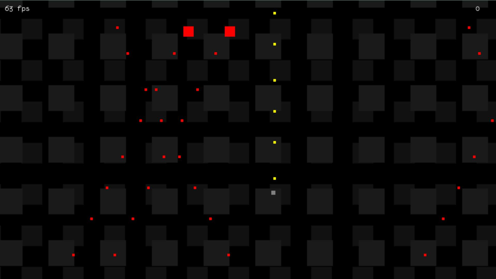

# Freddy vs JSON

A simple Top Down Shooter written in Javascript. It is using the Canvas API and no external libraries.

The aim is to show how to start a simple game and how the underlying techniques work.

You can try it here: https://nkoehring.github.io/FreddyvsJSON/

If you want to learn how to make something like this yourself you may check out the well documented source code. I also wrote [a rather extensive blog article, that goes describes the process](https://koehr.tech/freddy-vs-json-how-to-make-a-top-down-shooter) from the bottom up (ha ha, pun intended).
