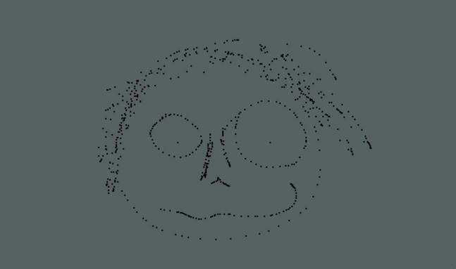

# Freddy vs JSON: how to make a top-down shooter

I will tell you how I created a simple top-down shooter in JavaScript without using any additional libraries.

---

A couple of years ago (Oh it's almost a decade! Am I that old already?), when the Canvas API got widely adopted by most browsers, I started experimenting with it. The fascination was high and I immediately tried to use it for interactive toys and games.

Of course, the games I made (and make) are usually not very sophisticated. That is mainly because I create them only for fun and without much eye-candy or even sound. What really fascinates me is the underlying mechanic. Otherwise, I could just use one of those [awesome game engines](https://github.com/collections/javascript-game-engines), that exist already.

To share some of the fun, I created a tiny top down shooter for a tech session in my company ([we're hiring, btw](https://wunder.dog)). The [result can be found on Github](https://github.com/nkoehring/FreddyvsJSON). I commented the code well so it should be quite helpful to just read it. But if you want to know how I created the game step-by-step, this article is for you.

## The Game

To give you an impression of what I created:


The little gray box is your ship. You are controlling the little gray box with either WASD or Arrow keys and you can shoot tiny yellow boxes at your enemies — the red boxes — by pressing Space or Enter. The enemies shoot back though. They don't really aim well, but at some point they'll flood the screen with tiny red boxes. If they hit you, they hurt. Every time you get hurt you shrink, until you completely disappear. The same happens with your opponents.

## Preconditions

This post is not about the game itself but about the underlying mechanics and some of the tricks used to make it work. My intention is to provide an entry for understanding more complex game development for people with some existing programming experience. The following things are helpful to fully understand everything:

### Fundamental Game Engine Mechanics

Most — if not all — game engines have the same fundamental building blocks:

* The `state`, that defines the current situation (like main menu, game running, game lost, game won, etc).
* A place to store all the objects and related data.
* The `main loop`, usually running sixty times per second, that reads the object information, draws the screen and applies updates to object data
* An `event handler` that maps key presses, mouse movements and clicks to data changes.

### The Canvas Element

The Canvas element allows you to handle pixel based data directly inside the browser. It gives you a few functions to draw primitives. It is easy to draw for example a blue rectangle but you need more than one action to draw a triangle; to draw a circle you need to know how to use arcs.

Exactly because drawing rectangles is the easiest and fastest thing to do with the Canvas API, I used them for everything in Freddy vs JSON. That keeps the complexities of drawing more exciting patterns or graphics away and helps focus on the actual game mechanics. This means, after initializing the canvas besides setting colors we only use two functions:

```js
const ctx = canvas.getContext('2d') // this is the graphics context
ctx.fillStyle = '#123456'           // use color #123456

ctx.fillText(text, x, y)            // write 'text' at coords x, y
ctx.fillRect(x, y, width, height)   // draw filled rectangle
```


### Modern JavaScript

The following code examples will be writting in ES6. Most up-to-date browsers support it without any need for [cross compilation tools like babel](https://babeljs.io) but it might look strange to you if you're not used to it. If pieces of code use a new style syntax it will be mentioned.

### Goal Of This Article

This article is not replicating a full game — [you can just take it directly from Github](https://github.com/nkoehring/FreddyvsJSON) — but instead shows which steps to take when and why. The goal is that, after reading this, one is able to understand the intention behind all the code pieces of the full game.

## Step One: Some HTML and an initialized Canvas

Because the code is going to run in the browser, some HTML is necessary. A minimal set would be just the following two lines:

```html
<canvas id="canvas" />
<script src="./app.js"></script>
```

This works but of course some styling would be great. And maybe having a title? Check out a [complete version on Github](https://github.com/nkoehring/FreddyvsJSON/blob/master/index.html).

Initializing a Canvas is also pretty simple. Inside `app.js` following lines are necessary:

```js
const canvas = document.getElementById('canvas')
canvas.width = 960  // you can do this in HTML, too
canvas.height = 540 // how ever you feel like
const ctx = canvas.getContext('2d')
```

I chose rather arbitrary values for width and height. Feel free to change them to your liking. Just know that higher values obviously will result in more work for your computer.

## Step Two: Game Mode / States

To avoid creating a [big ball of mud](http://en.wikipedia.org/wiki/Big_ball_of_mud) it is common to use a so called state machine. The idea is to describe the high level states and their valid transitions and using a central state handler to control them.

There are of course libraries that help with this but it is also not too hard to create this yourself. In the game I created, I did without any complexities like hooks (`beforeStateTransition()`, `afterStateTransition()`, etc). Instead, the possible states and their transitions are described in [Enum-like objects](https://en.wikipedia.org/wiki/Enumerated_type). Here some code to illustrate the idea. The code uses some new language features: [Symbols](https://developer.mozilla.org/en-US/docs/Glossary/Symbol) and [Computed Property Names](https://developer.mozilla.org/en-US/docs/Web/JavaScript/Reference/Operators/Object_initializer#Computed_property_names).

```js
const STATE = {
  start: Symbol('start'),  // the welcome screen
  game: Symbol('game'),    // the actual game
  pause: Symbol('pause'),  // paused game
  end: Symbol('end')       // after losing the game
}

const STATE_TRANSITION = {
  [STATE.start]: STATE.game, // Welcome screen => Game
  [STATE.game]: STATE.pause, // Game => Pause
  [STATE.pause]: STATE.game, // Pause => Game
  [STATE.end]: STATE.start   // End screen => Welcome screen
}
```

This is not a full state machine but does the job. For the sake of simplicity I violate the state machine in one occasion though: There is no transition from the running game to the end of the game. This means I have to jump directly, without using the state handler, to the end screen after the player dies. But this saved me from a lot of complexity. Now the state control logic is effectively only one line:

```js
newState = STATE_TRANSITION[currentState]
```

Freddy vs JSON uses this in the click handler. A click into the canvas changes the state from welcome screen to the actual game, pauses and un-pauses the game and brings you back to the welcome screen after losing. All that in only one line. The new state is set to a variable that is respected by the central update loop. More on that later.

Of course much more could be done with a state. For example weapon or ship upgrades could be realised. The game could transition towards higher difficulty levels and get special game states like an upgrade shop or transfer animations between stages. Your imagination is the limit. And the amount of lines in your state handler, I guess.

## Step Three: Data Handling

Games usually have a lot of information to take care of. Some examples are the position and health of the player, the position and health of each enemy, the position of each single bullet that is currently flying around and the amount of hits the player landed so far.

JavaScript allows different ways to handle this. Of course, the state could just be global. But we all (should) know that global variables are the root of all evil. Global constants are okay because they stay predictable. Just don't use global variables. If you're still not convinced, please read this [entry on softwareengineering.stackexchange.com](https://softwareengineering.stackexchange.com/questions/148108/why-is-global-state-so-evil).

But instead you could put everything into the same scope. A simple example is shown next. The following code examples use template literals, a new language feature. [Learn more about template literals here](https://developer.mozilla.org/en-US/docs/Web/JavaScript/Reference/Template_literals).


```js
function Game (canvas) {  // the scope
  const ctx = canvas.getContext('2d')
  const playerMaxHealth = 10
  let playerHealth = 10
  
  function handleThings () {
    ctx.fillText(`HP: ${playerHealth} / ${playerMaxHealth}`, 10, 10)
  }
}
```

This is nice because you have easy access just like with global variables without actually using global variables. It still opens the door to potential problems if you only have one big scope for everything, but the first game is probably small enough to get away with not thinking about this too much.

Another way is to use classes:

```js
class Game {
  constructor (canvas) {
    this.ctx = canvas.getContext('2d')
    this.playerMaxHealth = 10
    this.playerHealth = 10
  }
  
  handleThings () {
    const max = this.playerMaxHealth
    const hp = this.playerHealth
    ctx.fillText(`HP: ${hp} / ${max}`, 10, 10)
  }
}
```

That looks like a bit more boilerplate but classes are good to encapsulate common functionality. They get even better if your game grows and you want to stay sane. But in JavaScript they are just syntactical sugar. Everything can be achieved with functions and function scopes. So it is up to you, what you use. The two last code examples are essentially the same thing.

Now that we decided on how to save all the data (Freddy vs JSON uses a class so I'll use classes here too) we can further structure it... or not. Freddy vs JSON saves everything flat. That means for example each player attribute gets its own variable instead of using a player object that contains a lot of properties. The latter is probably more readable so you might want to go this path. Object access is also pretty fast nowadays so there is probably not a noticeable difference if you write `this.player.health` instead of `this.playerHealth`. If you are really serious about performance though, you might want to investigate this topic further. You can check out my [jsperf experiment](https://jsperf.com/nested-and-flat-property-access/1) for a start.

Data manipulation happens in the update loop or when handling events. The next steps explain these topics further.

## Step Four: The Main Loop

If event based changes are enough, like on a website, a separate loop wouldn't be necessary. The user clicks somewhere, which triggers an event that updates something and eventually re-renders a part of the page. But in a game some things happen without direct user interaction. Enemies come into the scene and shoot at you, there might be some background animation, music plays, and so on. To make all this possible a game needs an endlessly running loop which repeatedly calls a function that checks and updates the status of everything. And to make things awesomely smooth it should call this function in a consistent interval — at least thirty, better sixty times per second.

The following code examples use another rather new language feature called [Arrow Functions](https://developer.mozilla.org/en-US/docs/Web/JavaScript/Reference/Functions/Arrow_functions).

Typical approaches to run a function in an regular interval would include the usage of `setInterval`:

```js
let someValue = 23
setInterval(() => {
  someValue++
}, 16)
```

Or `setTimeout`

```js
let someValue = 42

function update () {
  someValue++
  setTimeout(update, 16)
}

update()
```

The first version just runs the function endlessly every sixteen milliseconds (which makes sixty-two and a half times per second), regardless of the time the function itself needs or if is done already. The second version does its potentially long running job before it sets a timer to start itself again after sixteen milliseconds.

The first version is especially problematic. If a single run needs more than sixteen milliseconds, it runs another time before the first run finished, which might lead to a lot of fun, but not necessarily to any useful result. The second version is clearly better here because it only sets the next timeout after doing everything else. But there is still a problem: Independent of the time the function needs to run it will wait an additional sixteen milliseconds to run the function again.

To mitigate this, the function needs to know how long it took to do its job and then substract that value from the waiting time:

```js
let lastRun
let someValue = 42

function update () {
  someValue++
  const duration = Date.now() - lastRun
  const time = duration > 16 ? 0 : 16 - time
  setTimeout(update, time)
  lastRun = Date.now()
}

lastRun = Date.now()
update()
```

`Date.now()` returns the current time in milliseconds. With this information we can figure out how much time passed since the last run. If more than sixteen milliseconds passed since then just start the update immediately and crush that poor computer (or better slow down the execution time and be nice to the computer), otherwise wait as long as necessary to stay at around sixty runs per second.

    Please note that Date.now() is not the best way to measure performance. To learn more about performance and high resolution time measurement, check out: [https://developer.mozilla.org/en-US/docs/Web/API/Performance](https://developer.mozilla.org/en-US/docs/Web/API/Performance)

Cool. This way you can also slow everything down to a chill thirty frames per second by setting the interval to thirty-three milliseconds. But lets not go that path. Lets do, what the cool kids with their shiny new browsers do. Lets use [requestAnimationFrame](https://developer.mozilla.org/en-US/docs/Web/API/window/requestAnimationFrame).

`requestAnimationFrame` takes your update function as an argument and will call it right before the next repaint. It also gives you the timestamp of the last call, so that you don't have to ask for another one, which potentially impacts your performance. Lets get down to the details:

```js
function update () {
  /* do some heavy calculations */
  requestAnimationFrame(update)
}

update()
```

This is the simplest version. It runs your update function as close as possible to the next repaint. This means it usually runs sixty times per second. Depending on the screen refresh rate of the computer it runs on it might be a different rate though. If your function takes longer than the duration between screen refreshes, it will simply skip some repaints because it is not asking for a repaint before it is finished. This way it will always stay in line with the refresh rate.

A function that does a lot of stuff might not need to run that often. Thirty times per second is usually enough to make things appear smooth and some other calculations might not be necessary every time. This brings us back to the timed function we had before, but in this version we use the timestamp that `requestAnimationFrame` is giving us when calling our function:

```js
let lastRun

function update (stamp) {
  /* heavy work here */
  lastRun = stamp
  
  // maybe 30fps are enough so the code has 33ms to do its work
  if (stamp - lastRun >= 33) {
    requestAnimationFrame(update)
  }
}

requestAnimationFrame(update) // makes sure the function gets a timestamp
```


## Step Five: Event Handling

People usually want to feel like they are in control of what they are doing. This brings us to a point where the game needs to handle their input. Input can be either a mouse movement, a mouse click or a key press. Key presses are also separated into pressing and releasing the key. I'll explain why later in this section.

If your game is the only thing running on that page (and it deserves that much attention, doesn't it?) input events can simply be bound to `document`. Otherwise they need to be bound to the canvas event directly. The latter can be more complicated with key events because key events work best with actual input fields. This means you need to insert one into the page, and make sure it stays focused so that it gets the events. Each click into the canvas would make it lose focus. To avoid that, you can use the following hack:

```js
inputElement.onblur = () => inputElement.focus()
```

Or you simply put everything to its own page and bind the event listeners to `document`. It makes your life much easier.

    Side note: People might wonder why I don't use addEventListener. Please use it if it makes you feel better. I don't use it here for simplicity reasons and it will not be a problem as long as each element has exactly one event listener for each event type.

### Mouse Movement

Mouse movements are not really used in Freddy vs JSON but this post wouldn't be complete without explaining them. So this is how you do it:

```js
canvas.onmousemove = mouseMoveEvent => {
  doSomethingWithThat(mouseMoveEvent)
}
```

This will be executed on every little movement of the mouse as long as it is on top of the canvas. Usually you want to [debounce](https://davidwalsh.name/javascript-debounce-function) that event handler because the event might fire at crazy rates. Another way would be to use it only for something very simple, like to save the mouse coordinates. That information can be used in a function that is not tied to the event firing, like our update function:

```js
class Game {
  constructor (canvas) {
    // don't forget to set canvas width and height,
    // if you don't do it, it will set to rather
    // small default values
    this.ctx = canvas.getContext('2d')
    this.mouseX = 0
    this.mouseY = 0
    
    // gets called at every little mouse movement
    canvas.onmousemove = event => {
      this.mouseX = event.offsetX
	  this.mouseY = event.offsetY
    }
    
    this.update()
  }
  
  // gets called at each repaint
  update () {
    requestAnimationFrame(() => this.update())
    this.fillRect('green', this.mouseX, this.mouseY, 2, 2)
  }
}
```


    The [MouseEvent object](https://developer.mozilla.org/en-US/docs/Web/API/MouseEvent) contains a lot of useful information.

This should draw two pixel wide boxes wherever you touch the canvas with your mouse. Yeah, a drawing program in ten lines! Photoshop, we're coming for you!

### Mouse Clicks

But lets get back to reality. Mouse clicks are another important interaction:

```js
canvas.onclick = mouseClickEvent => {
  doSomethingWithThat(mouseClickEvent)
}
```

The event object again contains all kind of useful information. They are [explained in more detail here](https://developer.mozilla.org/en-US/docs/Web/API/MouseEvent).

    Hey wait! That is the same page as for the mouse move event!
    You made a mistake!
    
    No, it is really the same event type. Makes life simpler, doesn't it?

Now to make use of the mouse clicks, lets adapt the former code example:

```js
class Game {
  constructor (canvas) {
    // set canvas.width and canvas.height here
    this.ctx = canvas.getContext('2d')
    this.mouseX = 0
    this.mouseY = 0
    this.drawing = false
    
    canvas.onmousemove = event => {
      this.mouseX = event.offsetX
	  this.mouseY = event.offsetY
    }
    canvas.onmousedown = () => {
      this.drawing = true
    }
    canvas.onmouseup = () => {
      this.drawing = false
    }
    
    this.update()
  }
  
  update () {
    requestAnimationFrame(() => this.update())
    if (this.drawing) {
      this.fillRect('green', this.mouseX, this.mouseY, 2, 2)
    }
  }
}
```
[Check it out on CodeSandbox](https://codesandbox.io/s/3qw6q7j535)

Now the boxes is only drawn while holding down the mouse button. Boom, one step closer to the ease of use of Photoshop! It is incredible, what you can do with it already. Just check out this true piece of art:




### Key Events

Of course, it is necessary to react on key presses. There are some old-school people like me who still prefer using the keyboard to navigate their space ship. Input handling is theoretically simple but practically it is everything but. That's why this section explains not only how key events work but also how to get them right. Look forward to event handling, the relationship between velocity and acceleration, and frame rate agnostic timing.

The simplest version of key event handling looks like this:

```js
document.onkeypress = keyPressEvent => {
  doSomethingWithThat(keyPressEvent)
}
```

But `keypress` is deprecated and should not be used. It is anyways better to separate the keypress into two events: KeyDown and KeyUp. I'll try to explain why.

Imagine you have that awesome space ship in the middle of the screen and want to make it fly to the right if the user presses `d` or `ArrowRight`:

```js
class Game {
  constructor(canvas, width, height) {
    // we'll need those values
    this.width = canvas.width = width;
    this.height = canvas.height = height;
    this.ctx = canvas.getContext("2d");

    this.shipSize = 10;
    this.shipHalf = this.shipSize / 2.0; // you'll need that a lot

    // position the ship in the center of the canvas
    this.shipX = width / 2.0 - this.shipHalf;
    this.shipY = height / 2.0 - this.shipHalf;

    // event is a KeyboardEvent:
    // https://developer.mozilla.org/en-US/docs/Web/API/KeyboardEvent
    document.onkeypress = event => {
      const key = event.key;
      if (key === "d" || key === "ArrowRight") {
        this.shipX++;
      }
    };

    this.update();
  }

  // convenience matters
  rect(color, x, y, w, h) {
    this.ctx.fillStyle = color;
    this.ctx.fillRect(x, y, w, h);
  }

  update() {
    // clean the canvas
    this.rect("black", 0, 0, this.width, this.height);

    // get everything we need to draw the ship
    const size = this.shipSize;
    const x = this.shipX - this.shipHalf;
    const y = this.shipY - this.shipHalf;

    // draw the ship
    this.rect("green", x, y, size, size);
    
    // redraw as fast as it makes sense
    requestAnimationFrame(() => this.update());
  }
}
```
[check it out on CodeSandbox](https://codesandbox.io/s/2w10vo897n)

Okay, that is kinda working, at least if you press `d`. But the arrow key is somehow not working and the ship's movement feels a bit jumpy. That doesn't seem to be optimal.

The problem is, that we're relying on repeated key events. If you press and hold a key, the `keypress` event is repeated a couple of times per second, depending on how you set your key repeat rate. There is no way to use that for a smooth movement because we can not find out how fast the users keys are repeating, so lets rather try to be smart!

Lets recap: We hold the key, the ship moves. We leave the key, the movement stops. That is what we want. What a happy coincidence that these two events have ...erm.. events:

```js
class Game {
  constructor(canvas, width, height) {
    // we'll need those values
    this.width = canvas.width = width;
    this.height = canvas.height = height;
    this.ctx = canvas.getContext("2d");

    this.shipSize = 10;
    this.shipHalf = this.shipSize / 2.0; // you'll need that a lot

    // position the ship in the center of the canvas
    this.shipX = width / 2.0 - this.shipHalf;
    this.shipY = height / 2.0 - this.shipHalf;

    this.shipMoves = false;

    // key is pressed down
    document.onkeydown = event => {
      const key = event.key;
      switch (key) {
        case "d":
        case "ArrowRight":
          this.shipMoves = "right";
          break;
        case "a":
        case "ArrowLeft":
          this.shipMoves = "left";
          break;
        case "w":
        case "ArrowUp":
          this.shipMoves = "up";
          break;
        case "s":
        case "ArrowDown":
          this.shipMoves = "down";
          break;
      }
    };

    document.onkeyup = () => {
      this.shipMoves = false;
    };

    this.update();
  }

  // convenience matters
  rect(color, x, y, w, h) {
    this.ctx.fillStyle = color;
    this.ctx.fillRect(x, y, w, h);
  }

  update() {
    // move the ship
    if (this.shipMoves) {
      if (this.shipMoves === "right") this.shipX++;
      else if (this.shipMoves === "left") this.shipX--;
      else if (this.shipMoves === "up") this.shipY--;
      else if (this.shipMoves === "down") this.shipY++;
    }

    // clean the canvas
    this.rect("black", 0, 0, this.width, this.height);

    // get everything we need to draw the ship
    const size = this.shipSize;
    const x = this.shipX - this.shipHalf;
    const y = this.shipY - this.shipHalf;

    // draw the ship
    this.rect("green", x, y, size, size);
    
    // redraw as fast as it makes sense
    requestAnimationFrame(() => this.update());
  }
}
```
[check it out on CodeSandbox](https://codesandbox.io/s/nr8r6myz60)

I felt like adding all directions right away. Now the movement itself is decoupled from the key events. Instead a value is set to a movement direction and the main loop takes care of the movement. That's great because we don't care about any repeated key events anymore.

But there are still some problems here. First of all, the ship can only move in one direction at a time. Instead it should always be able to move in two directions at a time, like up- and leftwards. Then the movement stops if the switch from one key to another is too fast. That might happen in a heated situation between your ship and the enemies bullets. Also the movement is bound to the frame rate. If your frame rate drops, your ship gets slower. And last but not least the ship simply jumps to full speed and back to zero. For a more natural feeling it should instead accelerate and break.

Lots of work. Lets tackle the problems one by one:

Bidirectional movements are easy to do. We just need a second variable. And to simplify things even more, we can set these variables to numbers instead of identifying strings:

```js
class Game {
  constructor(canvas, width, height) {
    /* ... same as before ... */

    this.shipMovesHorizontal = 0;
    this.shipMovesVertical = 0;

    // this time, the values are either positive or negative
    // depending on the movement direction
    document.onkeydown = event => {
      const key = event.key;
      switch (key) {
        case "d":
        case "ArrowRight":
          this.shipMovesHorizontal = 1;
          break;
        case "a":
        case "ArrowLeft":
          this.shipMovesHorizontal = -1;
          break;
        case "w":
        case "ArrowUp":
          this.shipMovesVertical = -1;
          break;
        case "s":
        case "ArrowDown":
          this.shipMovesVertical = 1;
          break;
      }
    };

    // to make this work, we need to reset movement depending
    // on the keys this time
    document.onkeyup = event => {
      const key = event.key;
      switch (key) {
        case "d":
        case "ArrowRight":
        case "a":
        case "ArrowLeft":
          this.shipMovesHorizontal = 0;
          break;
        case "w":
        case "ArrowUp":
        case "s":
        case "ArrowDown":
          this.shipMovesVertical = 0;
          break;
      }
    };

    this.update();
  }

  /* more functions here */

  update() {
    // move the ship
    this.shipX += this.shipMovesHorizontal;
    this.shipY += this.shipMovesVertical;

    /* drawing stuff */
  }
}
```
[Find the full version on CodeSandbox](https://codesandbox.io/s/v0l8v95nr5)

This not only allows the ship to move in two directions at the same time, it also simplifies everything. But there's still the problem, that fast key presses don't get recognized well.

What actually happens in those stressful moments is correct from the code's point of view: If a key of the same dimension (horizontal or vertical) is pressed, set the movement direction, if it is released set movement to zero. But humans are not very exact. They might press the left arrow (or `a`) a split second before they fully released the right arrow (or `d`). This way, the function switches the movement direction for that split second but then stops because of the released key.

To fix this, the `keyup` handler needs a bit more logic:

```js
document.onkeyup = event => {
  const key = event.key;
  switch (key) {
    case "d":
    case "ArrowRight":
      if (this.shipMovesHorizontal > 0) {
        this.shipMovesHorizontal = 0;
      }
      break;
    case "a":
    case "ArrowLeft":
      if (this.shipMovesHorizontal < 0) {
        this.shipMovesHorizontal = 0;
      }
      break;
    case "w":
    case "ArrowUp":
      if (this.shipMovesVertical < 0) {
        this.shipMovesVertical = 0;
      }
      break;
    case "s":
    case "ArrowDown":
      if (this.shipMovesVertical > 0) {
        this.shipMovesVertical = 0;
      }
      break;
  }
};
```
[Check out the full code at CodeSandbox](https://codesandbox.io/s/x765pl1zm4)

Much better, isn't it? Whatever we do, the ship is flying in the expected direction. Time to tackle the last problems. Lets go with the easier one first: Acceleration.

For now, the ship has simply a fixed speed. Lets make it faster first, because we want action, right? For that, we'll define a variable for the speed:

```js
this.shipSpeed = 5
```

And use it as a multiplicator:

```js
  update() {
    // move the ship
    this.shipX += this.shipMovesHorizontal * this.shipSpeed;
    this.shipY += this.shipMovesVertical * this.shipSpeed;

    /* drawing stuff */
  }
```

And now, instead of jumping to the full speed, we update velocity values per axis:

```js
  constructor () {
    /* ... */
    this.shipSpeed = 5
    this.shipVelocityHorizontal = 0
    this.shipVelocityVertical = 0
    /* ... */
  }
  
  /* ...more stuff... */
  
  update () {
    // accelerate the ship
    const maxSpeed = this.shipSpeed;
    let currentAbsSpeedH = Math.abs(this.shipVelocityHorizontal);
    let currentAbsSpeedV = Math.abs(this.shipVelocityVertical);

    if (this.shipMovesHorizontal && currentAbsSpeedH < maxSpeed) {
      this.shipVelocityHorizontal += this.shipMovesHorizontal * 0.2;
    } else {
      this.shipVelocityHorizontal = 0
    }
    if (this.shipMovesVertical && currentAbsSpeedV < maxSpeed) {
      this.shipVelocityVertical += this.shipMovesVertical * 0.2;
    } else {
      this.shipVelocityVertical = 0
    }

    /* drawing stuff */
  }
```

This slowly accelerates the ship until full speed but still stops immediately. To also decelerate the ship and make sure the ship actually stops and doesn't randomly float around due to rounding errors, some more lines are needed. You'll find everything in [the final version on CodeSandbox](https://codesandbox.io/s/kxpn09n077)

Now, finally the last problem can be solved: Framerate-dependent movement. For now, all the values are tweaked in a way that they work nicely at the current speed. Lets assume at sixty frames per second. Now that poor computer has to install updates in the background or maybe it is just Chrome getting messy, but the result is a drop of the frame rate down to the half. Thirty frames per second is still completely smooth for almost everything. Movies have thirty frames per second and they do just fine, right? Yet our ship is suddenly only half as fast.

To prevent this, the movement needs to be time based. Instead of a fixed value added to the coordinates, a value is added that respects the time passed since the last update. Same for velocity changes. So instead of the more or less arbitrary five pixels at sixty frames per second we set the value in pixels per millisecond (because everything is in millisecond precision).

```js
5px*60/s = 300px/s = 0.3px/ms
```

This makes the next step rather easy: Count the amount of milliseconds since the last update and multiply it with the maximum speed and acceleration values:

```js
  constructor () {
    /* ... */
    this.shipSpeed = 0.3 // px/ms
    // how fast the ship accelerates
    this.shipAcceleration = this.shipSpeed / 10.0
    this.shipVelocityHorizontal = 0
    this.shipVelocityVertical = 0
    /* ... */
    
    // this should always be right before the first update call
    this.lastDraw = performance.now()
    requestAnimationFrame(stamp => this.update(stamp))
  }
  
  /* ...more stuff... */
  
  // See the main loop section if stamp looks fishy to you.
  update (stamp) {
    // calculate how much time passed since last update
    const timePassed = stamp - this.lastDraw
    this.lastDraw = stamp

    // accelerate the ship
    const maxSpeed = this.shipSpeed * timePassed;
    const accel = this.shipAcceleration * timePassed;
    
    let currentAbsSpeedH = Math.abs(this.shipVelocityHorizontal);
    let currentAbsSpeedV = Math.abs(this.shipVelocityVertical);

    if (this.shipMovesHorizontal && currentAbsSpeedH < maxSpeed) {
      const acceleration = 
      this.shipVelocityHorizontal += this.shipMovesHorizontal * accel;
    } else {
      this.shipVelocityHorizontal = 0
    }
    if (this.shipMovesVertical && currentAbsSpeedV < maxSpeed) {
      this.shipVelocityVertical += this.shipMovesVertical * accel;
    } else {
      this.shipVelocityVertical = 0
    }

    /* drawing stuff */
  }
```
[Check out the full version at CodeSandbox](https://codesandbox.io/s/j4rzoq5kqy)

## The End

Congratulations, you made a fully moving ship. This Post ends here but of course there is so much more to learn about game development. [Freddy vs JSON](https://nkoehring.github.io/FreddyvsJSON) adds some more elements but uses only techniques described in this article. Feel free to check out [its source code](https://github.com/nkoehring/FreddyvsJSON) and create a ton of games like it. Or completely different ones.
